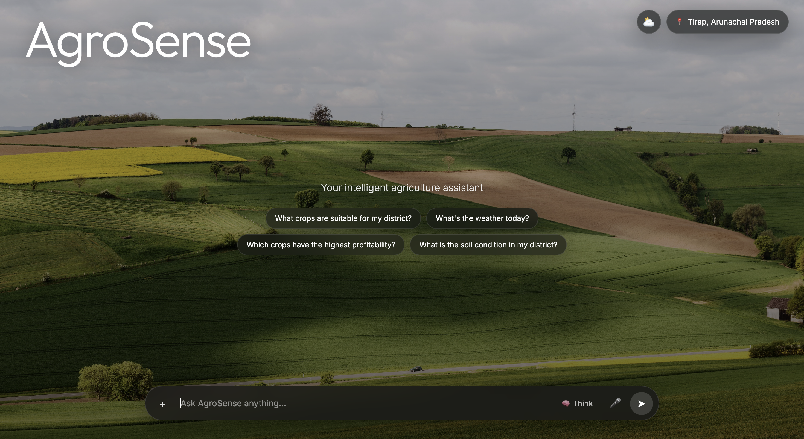
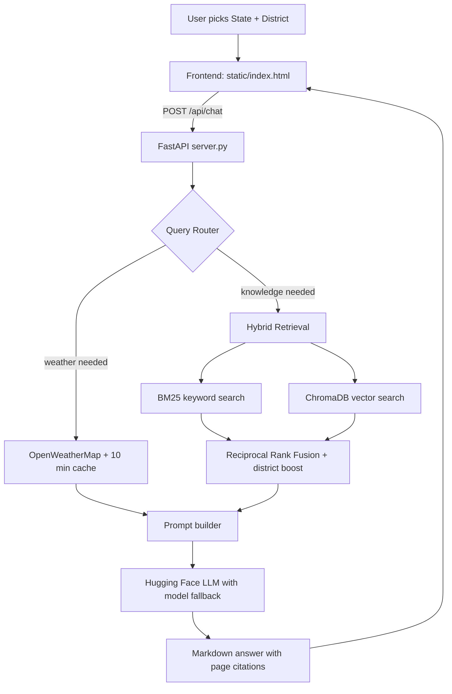

<div align="center">

# 🌾 AgroSense

### An AI agriculture assistant that gives district-level farming advice using live weather and a retrieval-augmented knowledge base.




</div>

---

## 📌 Overview

Farming decisions depend on **where** you are and **what the weather is right now**. Generic chatbots know neither. AgroSense asks for your state and district, then answers using:

- **District-specific knowledge** retrieved from an agricultural PDF (soil, crops, seasons, irrigation, statistics)
- **Live weather** for that district
- **An LLM** that combines both into plain-language advice, with page citations from the source document

The result is a premium, chat-style interface backed by a real retrieval pipeline, not a mock demo.

---

## ✨ Features

- **Location-aware answers:** a first-run modal captures State and District (36 states/UTs, searchable dropdowns). Every query carries that context, and it can be changed any time without restarting.
- **Hybrid retrieval (RAG):** BM25 keyword search and ChromaDB vector search, merged with **Reciprocal Rank Fusion**, plus a boost for chunks that mention the user's district.
- **Smart query router:** a lightweight keyword router decides whether a question needs `WEATHER`, `RETRIEVAL`, `BOTH`, or neither, so the app doesn't waste API or LLM calls. It understands English and Hinglish (e.g. *barish*, *fasal*, *sinchai*).
- **Live weather:** OpenWeatherMap integration with a 10-minute cache. It feeds both the LLM and a weather popup in the UI.
- **Resilient LLM layer:** Hugging Face Inference API with automatic fallback across multiple models if one fails or returns empty output.
- **Grounded, safety-minded prompting:** the system prompt forbids fabricating prices, dosages, scheme eligibility, or sources, and asks for page citations.
- **Polished UI:** glassmorphism design, Markdown rendering (tables, lists, code), voice input, a "Think" mode for more detailed answers, and clickable starter questions.
- **Graceful error handling:** missing keys, API failures, and slow responses show friendly messages and never leak tracebacks.

---

## 🏗️ Architecture



**Request flow:** the frontend sends `{query, state, district, think}`. The backend routes the question, gathers weather and/or document context, builds a grounded prompt, calls the LLM, and returns the answer.

---

## 🧰 Tech Stack

| Layer | Technology |
|---|---|
| Backend | Python, FastAPI, Uvicorn |
| RAG | LangChain (loaders and splitters), ChromaDB, `rank-bm25` |
| Embeddings | `sentence-transformers/all-MiniLM-L6-v2` |
| LLM | Hugging Face Inference API (Llama 3.1, Qwen 2.5, gpt-oss with fallback) |
| Weather | OpenWeatherMap API |
| Frontend | Vanilla HTML/CSS/JS, `marked` + `DOMPurify` for safe Markdown |

---

## 📁 Project Structure

```
AgroSense/
├── main.py            # RAG + agent core: router, weather, hybrid retrieval, LLM
├── server.py          # FastAPI layer exposing the agent to the web UI
├── locations.py       # States/UTs and districts for the location modal
├── static/
│   ├── index.html     # Full frontend (single file)
│   └── background.jpg # Background image (add your own)
├── requirements.txt
├── .env.example
└── README.md
```

---

## 🚀 Getting Started

### 1. Clone and install

```bash
git clone https://github.com/Kxbir31/AgroSense.git
cd AgroSense
python -m venv .venv
source .venv/bin/activate        # Windows: .venv\Scripts\activate
pip install -r requirements.txt
```

### 2. Add your data and assets

- Place your agriculture knowledge PDF in the project root as `India_District_Agri_Master_RAG.pdf` (not included in this repo).
- Add a landscape photo as `static/background.jpg`.

### 3. Configure environment variables

Create a `.env` file (see `.env.example`):

```env
HF_TOKEN=your_huggingface_token
OPENWEATHER_API_KEY=your_openweathermap_key
```

- Hugging Face token: https://huggingface.co/settings/tokens (enable *Inference Providers*)
- OpenWeatherMap key: https://openweathermap.org/api

### 4. Run

```bash
uvicorn server:app --host 127.0.0.1 --port 8000
```

Open **http://127.0.0.1:8000**. The first start builds the vector database from your PDF, which takes a minute or two. Later starts reuse it. If you change the PDF, delete the `chroma_db/` folder so it rebuilds.

---

## 💬 Example Questions

- *What crops are suitable for my district?*
- *Should I spray pesticide today?* (uses live weather and district data)
- *What is the soil condition in my district?*
- *Kal barish hogi kya, sinchai karni chahiye?* (Hinglish supported)

---

## 🔐 Security Notes

- API keys live only in `.env` and are never sent to the browser.
- User input is validated server-side, and model output is sanitized before rendering.
- `.env` and the generated `chroma_db/` are git-ignored.

---

## 🗺️ Roadmap

- [ ] Multi-day weather forecast support
- [ ] Conversation memory across turns
- [ ] Multilingual UI (Hindi and regional languages)
- [ ] Streaming responses
- [ ] Docker deployment

---

## 👤 Author

**Kabir Bhardwaj**
GitHub: [@Kxbir31](https://github.com/Kxbir31)

If you find this project useful, consider giving it a ⭐
